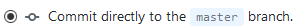

# MSGW2020 Project deliverable 3: timeline

To create your own timeline for this project deliverable, you will need:

## Ingredients

- [A GitHub account](https://github.com/join)
- A plain text editor. You can try [Sublime Text](https://www.sublimetext.com/3) or [Atom](https://atom.io/) (both are free)
- A spreadsheet editor (like Microsoft Excel or LibreOffice Calc)
- The [group0.zip](https://github.com/mberasategi/timelinejs-local/blob/master/group0.zip) file. 

## Instructions

1. Extract `group0.zip` in your computer and rename the folder `group0` to include your group number.
2. Open the `index.html` file from that folder with a plain-text editor (Sublime Text or Atom), and follow the instructions there: {style="width:18em;float:right;margin-left:1.2em;"}
    - Give a title to your timeline in the `title` tag, in line 7
    - Choose the font pair you want to use and change `default` to the corresponding name, in line 18
    - Save it when you are finished
3. Upload the whole folder to [the `docs` folder in the GitHub repository](https://github.com/mberasategi/timelinejs-local/tree/master/docs): just drag and drop the folder to the browser window. Write a descriptive commit message (like "First upload of group0 folder", with your group number instead of 0, for example). Make sure {style="vertical-align:bottom;padding:0 .3em;margin:0 .3em;border:solid 1px #ccc"} is selected, and click "Commit changes".
    - Now your timeline, although empty, is uploaded and accesible online through `https://miren.be/timeline-js/group0` (change `0` with your group number or `group0` with your folder name).
4. Create your own timeline by editing the `timeline-data.csv` file in your spreadsheet editor:
    - Open or import the data (depending on your spreadsheet software), making sure you specify charset `UTF8`. 
    - 
5. Edit the timeline itself,
    - follow https://timeline.knightlab.com/docs/using-spreadsheets.html
    - media types https://timeline.knightlab.com/docs/media-types.html
6. Upload to the site by drag and drop, wait a bit for changes to update

Embed: <iframe src="http://miren.be/timelinejs-local/group0/" style="width:100%;min-height:600px;" frameborder="0"></iframe>

---

Based on [heoinfo/timelinejs-local](https://github.com/heoinfo/timelinejs-local) and [NUKnightLab/TimelineJS3](https://timeline.knightlab.com/) 